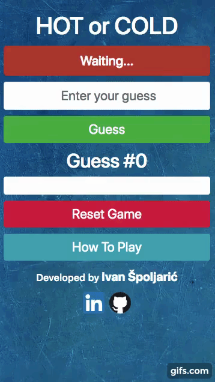

# The Hot and Cold game app
## LINK TO THE APP:
[https://hot-and-cold-app.netlify.com](https://hot-and-cold-app.netlify.com)

## SUMMARY
This is a game where the user guesses a random number in the interval 1-100 set by the computer, and gets feedback in the form of the following words; cold, warm, hot, extremely hot.
The purpose is to guess the number in as little attempts as possible.
The user can track his progress because previous attempts are available.

## DEMO VIDEO

## BUILT WITH:

**TESTING**: ENZYME (a few component unit tests)

**CLIENT SIDE**: HTML5, CSS3, REACT (ES6 JS)

**AUTOMATION**: CREATE-REACT-APP

### This project was bootstrapped with Create React App.

